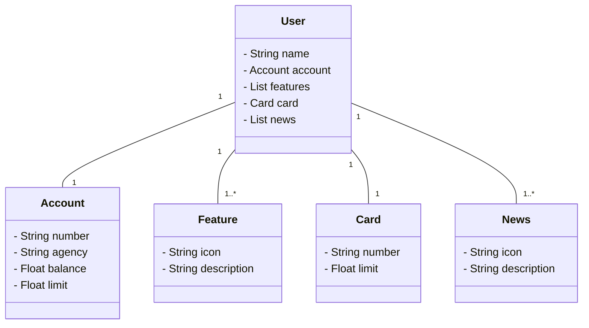

# Project API RESTFul Spring
Criando uma aplicação API RESTFul utilizando Java, Spring e PostegreSQL

## Tecnologias utilizadas

- Java 11
- Spring
- H2 Database
- Swagger (SpringDoc OpenAPI)
- Railway
- PostgreSQL

## Diagrama de classes

### Documentação da API (Swagger)

- Link: https://sdw-2023-api-production-1e0e.up.railway.app/swagger-ui/index.html

### URL da Produção (Railway)

- Link: https://sdw-2023-api-production-1e0e.up.railway.app/
  
